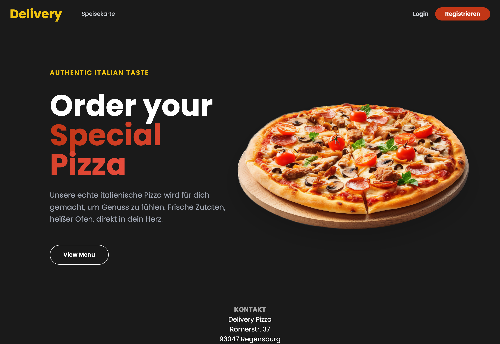
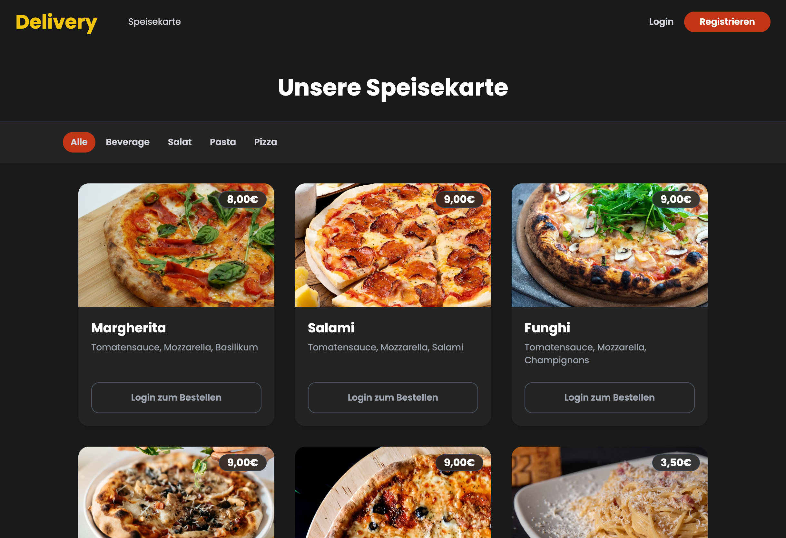

# Pizza Delivery Web-App 🍕

<div align="center">
  
</div>

Eine interaktive Full-Stack Webanwendung für einen fiktiven Pizza-Lieferservice. Das Projekt umfasst ein responsives Frontend, ein dynamisches Backend mit Session-basiertem Warenkorb und eine Anbindung an eine relationale Datenbank.

> **Hinweis:** Dieses Projekt habe ich im Rahmen meines Informatik-Studiums (2. Semester) entwickelt, um meine praktischen Fähigkeiten in der Full-Stack Web-Entwicklung (Node.js, Express, SQL) und modernen CSS-Frameworks (Tailwind) zu vertiefen.

---

## 📸 Einblicke in die App

### Die interaktive Speisekarte


---

## ✨ Features

* **Interaktive Speisekarte:** Übersichtliche Darstellung von Pizzen, Pasta, Salaten und Getränken (Gerendert via Handlebars).
* **Dynamischer Warenkorb:** Session-basierte Speicherung der ausgewählten Artikel (`express-session`) mit automatischer serverseitiger Preisberechnung.
* **Benutzerverwaltung:** Registrierung und Login für Kunden.
* **Admin-Bereich:** Spezielle Ansichten und Berechtigungen für Administratoren zur Verwaltung von Produkten und Bestellungen.
* **Datenbank-Anbindung:** Persistente Speicherung von Usern, Produkten und Bestellungen in einer PostgreSQL-Datenbank.
* **Logging:** Integriertes serverseitiges Logging aller wichtigen Ereignisse über `winston`.

## 🛠 Tech-Stack

* **Frontend:** HTML, Tailwind CSS, Handlebars (`hbs`)
* **Backend:** Node.js, Express.js
* **Datenbank:** PostgreSQL (`pg`)
* **Weitere Tools:** `dotenv` (Environment-Variablen), `express-session` (Session-Management), `csv-parse` (Datenimport)

## 🚀 Setup & Installation

Folgende Voraussetzungen müssen erfüllt sein:
* Node.js installiert (mindestens v18+)
* Eine laufende PostgreSQL-Datenbank

**1. Repository klonen und Abhängigkeiten installieren:**
```bash
git clone <deine-repo-url>
cd delivery
npm install
